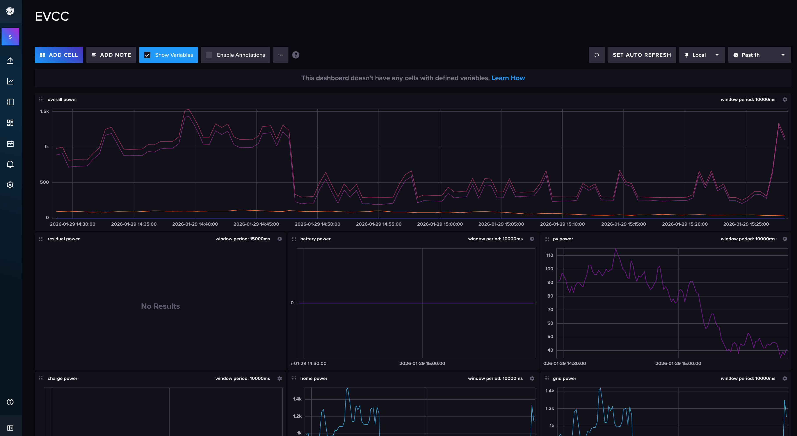
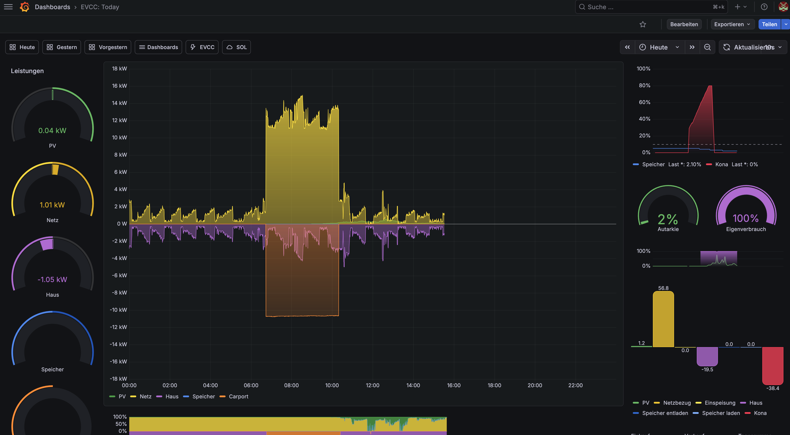

# smarty

Dieses Repository enthält alle relevanten Dateien, um einen Raspberry für EVCC und PV Historie vorzubereiten. Sinn ist es, die gesammelten Daten (neben der genaueren Steuerung der Wallbox durch EVCC) auch sinnvoll zu präsentieren.
Dazu wird EVCC als Container gestartet und dieses meldet regelmäßig die Daten an eine InfluxDB2. Von dort werden die Daten durch ein Grafana ausgelesen und in entsprechenden Dashboards präsentiert.

## Installation

Diese Teil der Anleitung ist nur relevant, wenn man von null anfängt.

Benötigt werden

- Raspberry PI 4 4GB RAM empfohlen
- MicroSD oder andere Speicher für den Raspberry

Dann wie folgt das Betriebssystem installieren

- Raspberry PI Installer herunterladen und auf dem eigenen Rechner installieren
- Installer starten und im Wizard folgende Einträge machen:
  - das korrekte Modell auswählen (z.B. Raspberry PI 4)
  - Betriebssystem: Raspberry PI OS (64-bit)
  - Speicher: den korrekten Micro-SD-Card Slot auswählen.
  - Hostname wählen: evcc
  - Location setzen: Hauptstadt Berlin, Zeitzone: Europe/Berlin, Tastatur: de
  - Benutzer anlegen: Name evcc, Passwort evcc
  - WLAN konfigurieren, wenn nötig
  - SSH aktivieren, mit Passwortauthentifizierung
  - Raspberry PI Connect nicht akivieren
  - Dann den Button: Schreiben auswählen
- Dann wird das Betriebssystem auf die MicroSD Karte geschrieben
- Die MicroSD Karte in den Raspberry einlegen
- Raspberry Strom, Netzwerkkabel und evtl. für die Einrichtung Monitor, Tastatur und Maus anschleßen
- der Raspberry startet automatisch, sofern Strom anliegt

Nun das System einrichten. Entweder lädt man dieses Repository herunter (präferiert) oder erstellt es manuell. Auf jeden Fall via SSH einloggen oder via Terminal auf dem Rechner eine Konsole öffnen und folgende Befehle eingeben

- sudo su -
- cd /srv
- git clone git@github.com:trickert76/smarty.git
- cd /srv/smarty
- ./bin/install.sh

Damit ist das System eingerichtet und startet.

## Links

EVCC - https://evcc.io

InfluxDB - https://https://www.influxdata.com

Grafana EVCC Dashboards - https://github.com/ha-puzzles/evcc-grafana-dashboards

